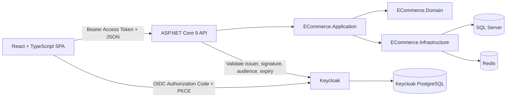

# Full-Stack E-Commerce with Keycloak
## eBay-Inspired UI — Real API and Database Data Only

> This document replaces the mock-data phases in the existing frontend PRD and technical specification. It is designed to integrate with the uploaded `E-CommerceFakePayment` ASP.NET Core solution.

---

## 1. Project Objective

Build a complete full-stack e-commerce application with:

- An eBay-inspired storefront and product discovery experience.
- A separate administration area for catalog, inventory, orders, payments, refunds, users, and reports.
- React + TypeScript frontend.
- ASP.NET Core 9 Clean Architecture backend.
- SQL Server application database.
- Redis for caching, distributed locks, sales statistics, and notifications.
- Keycloak authentication and role-based authorization.
- Real HTTP requests to the backend from the first implementation milestone.
- Real persisted data from SQL Server only.
- A backend-controlled fake payment provider for development/testing.

The application must not copy eBay branding, logo, copyrighted imagery, or proprietary content. It should use an original brand while following similar marketplace UX patterns: prominent search, category browsing, product discovery, detailed filtering, watchlist, cart, checkout, and account management.

---

## 2. Non-Negotiable Requirements

### 2.1 No Mock Data

The project MUST NOT contain:

- `mockProducts`, `mockOrders`, `mockUsers`, or similar arrays.
- JSON fixture files used as runtime business data.
- Fake API clients returning hardcoded responses.
- `setTimeout`-based API simulation.
- Frontend-generated IDs, order statuses, payment statuses, stock values, totals, or sales statistics.
- LocalStorage as the source of truth for products, carts, wishlists, orders, profiles, or payments.
- Demo dashboards with hardcoded KPI values.

All business data must come from the ASP.NET Core API and be persisted in SQL Server.

Allowed frontend-only state:

- Open/closed dialogs.
- Selected tab.
- Temporary form input.
- Sort/filter controls before they are applied.
- Theme preference.
- Non-authoritative display preferences.

### 2.2 Empty Database Behavior

When the database contains no products, categories, orders, or reports:

- The UI must show a professional empty state.
- The UI must not inject sample records.
- An authorized administrator must create the first categories and products through the admin UI or API.

### 2.3 Fake Payment Is Not Mock Product Data

The development payment module may remain fake, but it must operate through the backend:

1. The frontend creates an order through the API.
2. The frontend creates a payment record through the API.
3. The backend payment provider processes the test request.
4. The backend persists `Pending`, `Paid`, or `Failed`.
5. The frontend renders the returned persisted state.

The frontend must never directly set a payment to `Paid`.

---

## 3. Existing Solution Alignment

The uploaded backend already follows this project structure:

```text
E-Commerce/
├── ECommerce.sln
└── src/
    ├── ECommerce.Domain/
    ├── ECommerce.Application/
    ├── ECommerce.Infrastructure/
    └── ECommerce.Api/
```

Existing backend patterns that must be preserved:

- Clean Architecture.
- Domain entities and value objects.
- CQRS with MediatR.
- FluentValidation.
- Mapster mappings.
- Aggregate-specific repositories.
- Unit of Work.
- EF Core configurations and migrations.
- Global exception middleware.
- Result pattern.
- Async APIs with `CancellationToken`.
- Redis services.
- IP rate limiting.

Existing business modules that must be used rather than replaced:

- Categories.
- Products.
- Customer profiles.
- Addresses.
- Shopping carts.
- Wishlists.
- Orders.
- Payments.
- Refunds.
- Product reviews.
- Inventory transactions.
- Sales statistics.

### 3.1 Database Decision

Use SQL Server for the e-commerce application because the uploaded Infrastructure project currently uses:

- `Microsoft.EntityFrameworkCore.SqlServer`.
- A SQL Server `DefaultConnection`.
- Existing SQL Server-compatible EF Core migrations.

Do not change the application database to PostgreSQL unless a separate migration task is explicitly approved.

Keycloak may use its own PostgreSQL database in Docker. Keycloak data must remain separate from the e-commerce domain database.

---

## 4. Target Architecture



### 4.1 Authentication Flow

1. A visitor can browse public categories and active products without signing in.
2. Protected actions redirect the user to Keycloak.
3. The React SPA uses Authorization Code Flow with PKCE.
4. Keycloak returns tokens to the SPA.
5. The API client sends the access token in the `Authorization: Bearer` header.
6. ASP.NET Core validates token signature, issuer, audience, and expiration.
7. Authorization policies check Keycloak roles.
8. Customer-owned resources are resolved using the token subject, not a customer ID supplied by the browser.

---

## 5. Technology Stack

### 5.1 Frontend

- React 18 or a compatible current React version.
- TypeScript.
- Vite.
- React Router.
- TanStack Query for server state.
- Axios or a typed Fetch wrapper for HTTP.
- `keycloak-js` for OIDC integration.
- Tailwind CSS.
- shadcn/ui and Radix UI primitives.
- React Hook Form.
- Zod.
- Lucide icons.
- Recharts for API-driven admin charts.
- ESLint.
- Prettier.
- Vitest.
- React Testing Library.
- Playwright for end-to-end tests.

### 5.2 Backend

- ASP.NET Core 9 Web API.
- .NET 9.
- Entity Framework Core 9.
- SQL Server.
- Redis.
- MediatR.
- FluentValidation.
- Mapster.
- Swagger/OpenAPI.
- JWT bearer authentication.
- Policy-based and role-based authorization.
- xUnit for tests.

### 5.3 Identity

- Keycloak.
- OpenID Connect.
- OAuth 2.0 Authorization Code Flow with PKCE.
- Public SPA client.
- Separate API audience/client.
- Realm or client roles mapped into access tokens.

---

## 6. Monorepo Structure

Keep frontend and backend in separate top-level folders.

```text
E-Commerce/
├── E-CommerceSystem/
│   ├── ECommerce.sln
│   ├── src/
│   │   ├── ECommerce.Domain/
│   │   ├── ECommerce.Application/
│   │   ├── ECommerce.Infrastructure/
│   │   └── ECommerce.Api/
│   └── tests/
│       ├── ECommerce.UnitTests/
│       └── ECommerce.IntegrationTests/
│
├── E-CommerceInterface/
│   ├── public/
│   ├── src/
│   ├── package.json
│   ├── vite.config.ts
│   └── tsconfig.json
│
├── infrastructure/
│   ├── keycloak/
│   │   ├── realm-export.json
│   │   └── themes/
│   ├── sqlserver/
│   └── docker-compose.yml
│
├── .env.example
└── README.md
```

Do not commit:

- `.vs/`.
- `bin/`.
- `obj/`.
- `node_modules/`.
- real secrets.
- production realm private keys.

---

## 7. Frontend Architecture

```text
E-CommerceInterface/src/
├── app/
│   ├── router/
│   │   ├── AppRouter.tsx
│   │   ├── routePaths.ts
│   │   └── routeConfig.tsx
│   ├── providers/
│   │   ├── AppProviders.tsx
│   │   ├── AuthProvider.tsx
│   │   └── QueryProvider.tsx
│   └── queryClient.ts
│
├── core/
│   ├── api/
│   │   ├── apiClient.ts
│   │   ├── apiError.ts
│   │   ├── authInterceptor.ts
│   │   └── pagination.ts
│   ├── auth/
│   │   ├── keycloak.ts
│   │   ├── auth.types.ts
│   │   ├── useAuth.ts
│   │   ├── ProtectedRoute.tsx
│   │   └── RoleGuard.tsx
│   ├── config/
│   │   └── env.ts
│   ├── constants/
│   ├── types/
│   ├── utils/
│   └── validation/
│
├── components/
│   ├── ui/
│   ├── common/
│   │   ├── AppLogo.tsx
│   │   ├── Currency.tsx
│   │   ├── PageHeader.tsx
│   │   ├── Pagination.tsx
│   │   ├── ProductCard.tsx
│   │   ├── SearchBar.tsx
│   │   └── StatusBadge.tsx
│   └── feedback/
│       ├── EmptyState.tsx
│       ├── ErrorState.tsx
│       ├── LoadingSkeleton.tsx
│       └── NotFoundState.tsx
│
├── features/
│   ├── auth/
│   ├── categories/
│   ├── products/
│   ├── cart/
│   ├── wishlist/
│   ├── checkout/
│   ├── orders/
│   ├── payments/
│   ├── refunds/
│   ├── reviews/
│   ├── profile/
│   ├── addresses/
│   ├── inventory/
│   ├── users/
│   └── reports/
│
├── layouts/
│   ├── StorefrontLayout.tsx
│   ├── AccountLayout.tsx
│   └── AdminLayout.tsx
│
├── pages/
│   ├── public/
│   ├── account/
│   └── admin/
│
├── lib/
│   └── utils.ts
└── main.tsx
```

### 7.1 Feature Folder Rule

Each feature should contain only the files it owns.

```text
features/products/
├── api/
│   ├── productApi.ts
│   └── productKeys.ts
├── components/
├── hooks/
├── schemas/
├── types/
└── utils/
```

There must be no `mocks/` directory.

### 7.2 API Access Rule

React components must not call `fetch` or Axios directly.

Correct flow:

```text
Page/Component
  -> feature hook
  -> feature API function
  -> core API client
  -> ASP.NET Core API
```

Example:

```ts
export const productKeys = {
  all: ["products"] as const,
  search: (params: ProductSearchParams) => ["products", "search", params] as const,
  detail: (id: string) => ["products", "detail", id] as const,
};
```

TanStack Query cache is a client-side cache, not a source of truth. Mutations must invalidate or update queries using data returned by the API.

---

## 8. eBay-Inspired Storefront UX

### 8.1 Visual Direction

Use an original marketplace design with:

- Light storefront theme by default.
- White surfaces and neutral borders.
- Strong search-first navigation.
- Rounded product imagery.
- High information density without visual clutter.
- Clear prices, stock state, ratings, shipping information, and actions.
- Responsive desktop, tablet, and mobile layouts.
- Dark mode may be optional, but it must not be the only theme.

### 8.2 Global Header

Desktop header:

1. Utility row:
   - Greeting or sign-in/register.
   - Help and contact.
   - Wishlist.
   - Account menu.
   - Admin link only for authorized staff.

2. Main row:
   - Original brand logo.
   - “Shop by category” menu.
   - Large search input.
   - Category selector.
   - Search button.
   - Cart button with API-derived item count.

3. Category navigation:
   - Active categories loaded from `GET /api/categories`.
   - No hardcoded category list.

Mobile header:

- Menu trigger.
- Logo.
- Search.
- Account.
- Cart.
- Scrollable category chips or category drawer.

### 8.3 Home Page

The home page must use real API data and include:

- Search entry point.
- Category navigation.
- Recently added products from the product search API.
- Featured section only if the backend supports a real featured flag or rule.
- Popular products only if calculated from real sales statistics.
- Recently viewed products may use browser history, but product details must be refreshed from the API.
- Empty-state content when no products exist.

Do not show fake hero statistics, fake discounts, fake ratings, or sample products.

### 8.4 Product Listing Page

Required capabilities:

- Keyword search.
- Category filter.
- Pagination.
- Page-size selection.
- Sort by newest, price low-to-high, and price high-to-low after backend support is added.
- Active products only for public users.
- Loading skeleton.
- API error state with retry.
- Empty result state.
- Filter drawer on mobile.

The current backend supports `keyword`, `categoryId`, `page`, and `pageSize`. Sorting and price filters require backend query extensions.

### 8.5 Product Card

Display only values returned by the API:

- Product image when image support is implemented.
- Name.
- Price.
- Availability or stock state.
- Rating summary only when returned by a review summary endpoint.
- Wishlist action for signed-in users.
- Add-to-cart action when stock is available.

Do not generate random ratings, previous prices, discount percentages, or sold counts.

### 8.6 Product Details Page

Required sections:

- Image gallery.
- Product title.
- Price.
- Stock availability.
- Quantity selector constrained by API stock.
- Add to cart.
- Add to wishlist.
- Description.
- Category.
- Reviews loaded from the API.
- Related products only when the backend provides a real category-based query.

### 8.7 Cart

- Cart is loaded from the authenticated customer API.
- Quantity changes are persisted immediately.
- Remove item requires confirmation.
- Totals are displayed from the backend response.
- The frontend may calculate a preview but must accept the server total as authoritative.
- Cart count in the header comes from the cart query.

### 8.8 Checkout

Checkout requires authentication.

Steps:

1. Confirm cart items.
2. Select or create a real persisted address.
3. Add optional order note.
4. Submit order to the API.
5. Create payment.
6. Process payment through the backend test payment provider.
7. Display the persisted result.
8. Redirect to order details after success.

The order amount and item prices must be calculated by the backend, not trusted from the browser.

### 8.9 Account Area

Authenticated customer pages:

- Profile.
- Addresses.
- Wishlist.
- Cart.
- Order history.
- Order details.
- Payment details.
- Refund requests.
- Review creation for delivered products only.

### 8.10 Admin Area

Admin layout:

- Collapsible sidebar.
- Header with breadcrumbs.
- Current user menu.
- Role-aware navigation.
- Responsive drawer on mobile.

Admin modules:

- Dashboard using real sales statistics.
- Categories.
- Products.
- Inventory transactions.
- Orders.
- Payments.
- Refunds.
- Reviews moderation.
- Customer profiles.
- Reports.

Never render fake KPI values. A KPI must be `0` when the real API returns zero.

---

## 9. Frontend Routes

### 9.1 Public Routes

| Route | Purpose |
|---|---|
| `/` | Marketplace home |
| `/products` | Product search and listing |
| `/products/:productId` | Product details |
| `/categories/:categoryId` | Category product listing |
| `/auth/callback` | Keycloak redirect callback if required by the adapter setup |
| `/unauthorized` | Authenticated but insufficient permission |
| `*` | Not found |

### 9.2 Authenticated Customer Routes

| Route | Purpose |
|---|---|
| `/cart` | Shopping cart |
| `/checkout` | Address and order confirmation |
| `/payment/:paymentId` | Development payment processing UI |
| `/payment/:paymentId/result` | Persisted payment result |
| `/account` | Account overview |
| `/account/profile` | Profile |
| `/account/addresses` | Address management |
| `/account/wishlist` | Wishlist |
| `/account/orders` | Order history |
| `/account/orders/:orderId` | Order details |
| `/account/refunds` | Refund history and requests |

### 9.3 Admin Routes

| Route | Required role/policy |
|---|---|
| `/admin` | `ADMIN` or `REPORT_VIEWER` |
| `/admin/categories` | `CATALOG_MANAGER` |
| `/admin/products` | `CATALOG_MANAGER` |
| `/admin/inventory` | `INVENTORY_MANAGER` |
| `/admin/orders` | `ORDER_MANAGER` |
| `/admin/payments` | `PAYMENT_MANAGER` |
| `/admin/refunds` | `REFUND_MANAGER` |
| `/admin/reviews` | `REVIEW_MODERATOR` |
| `/admin/customers` | `ADMIN` |
| `/admin/reports` | `REPORT_VIEWER` |

`ADMIN` may be configured as a composite role containing all staff roles.

---

## 10. Keycloak Design

### 10.1 Realm

```text
Realm: ecommerce
```

### 10.2 Clients

#### `ecommerce-web`

Purpose: React SPA.

Configuration:

- OpenID Connect.
- Public client.
- Client authentication disabled.
- Standard authorization code flow enabled.
- PKCE S256.
- Direct access grants disabled.
- Implicit flow disabled.
- Valid redirect URIs restricted to exact frontend origins and paths.
- Web origins restricted to allowed frontend origins.
- Post-logout redirect URIs configured.

#### `ecommerce-api`

Purpose: API audience and API roles.

Configuration:

- OpenID Connect resource/API client.
- Access tokens issued to the SPA must include `ecommerce-api` as an audience.
- Client roles may be defined here.
- The API validates the expected audience.

Do not store a client secret in the React application.

### 10.3 Roles

Minimum roles:

```text
CUSTOMER
ADMIN
CATALOG_MANAGER
INVENTORY_MANAGER
ORDER_MANAGER
PAYMENT_MANAGER
REFUND_MANAGER
REVIEW_MODERATOR
REPORT_VIEWER
```

Recommended approach:

- Assign `CUSTOMER` to normal shoppers.
- Make `ADMIN` a composite role containing all management roles.
- Use specific staff roles for least-privilege access.

### 10.4 Token Claims

Required claims:

- `sub` — immutable Keycloak user identifier.
- `preferred_username`.
- `email` when available.
- `given_name` when available.
- `family_name` when available.
- API audience.
- Realm roles and/or `ecommerce-api` client roles.

The application must use `sub` as the external identity key. Email must not be used as the permanent identity key because an email can change.

---

## 11. Customer Identity Mapping

The current `CustomerProfile` model must be extended so a profile is linked to Keycloak.

Required field:

```csharp
public string KeycloakUserId { get; private set; } = string.Empty;
```

Database requirements:

- `KeycloakUserId` is required.
- Maximum length should safely support Keycloak subject values.
- Unique index on `KeycloakUserId`.
- Existing email rules may remain, but email is not the ownership key.

### 11.1 Profile Provisioning

Preferred flow:

1. User signs in through Keycloak.
2. Frontend calls `GET /api/customer-profiles/me`.
3. If no profile exists, the backend creates one from trusted token claims or returns a controlled onboarding response.
4. User completes missing phone/profile fields.
5. Subsequent requests resolve the profile by `User.FindFirst("sub")`.

Do not allow the browser to choose another user's `CustomerProfileId`.

### 11.2 Current API Ownership Issue

The existing API accepts customer IDs in route parameters or request bodies for carts, wishlists, orders, addresses, and reviews. These inputs are unsafe after authentication because a user could attempt to submit another customer's ID.

Customer-facing routes must be changed to `/me` semantics or must ignore browser-supplied customer IDs and derive ownership from the access token.

---

## 12. ASP.NET Core Authentication and Authorization

### 12.1 Required API Changes

Add the JWT bearer package to the API project.

Configure:

- Authentication scheme.
- Keycloak authority.
- API audience.
- HTTPS metadata requirement by environment.
- Token validation.
- Role claim mapping.
- Authorization policies.

Middleware order must include:

```csharp
app.UseCors("Frontend");
app.UseAuthentication();
app.UseAuthorization();
app.MapControllers();
```

The current API calls `UseAuthorization()` but does not configure or call `UseAuthentication()`. This must be corrected.

### 12.2 Configuration Shape

```json
{
  "Keycloak": {
    "Authority": "http://localhost:8080/realms/ecommerce",
    "Audience": "ecommerce-api",
    "RequireHttpsMetadata": false
  },
  "Cors": {
    "AllowedOrigins": [
      "http://localhost:5173"
    ]
  }
}
```

Production must use HTTPS and must not set `RequireHttpsMetadata` to `false`.

### 12.3 Authorization Policies

Recommended policies:

```text
CustomerOnly
AdminOnly
CatalogManagement
InventoryManagement
OrderManagement
PaymentManagement
RefundManagement
ReviewModeration
ReportViewing
```

Controllers and actions must use `[Authorize]` and policy attributes.

### 12.4 Ownership Authorization

Role checks are not enough for customer data.

For every customer-owned resource, verify:

- The access token subject maps to a customer profile.
- The cart, wishlist, address, order, payment, refund, or review belongs to that profile.
- Staff access is allowed only through an explicit policy.

Return:

- `401` when no valid authentication is present.
- `403` when the user is authenticated but not allowed.
- `404` when hiding the existence of another user's resource is appropriate.

---

## 13. API Contract Strategy

### 13.1 Preserve Existing Endpoints

The uploaded API already exposes these route groups:

```text
/api/addresses
/api/categories
/api/customerprofiles
/api/inventorytransactions
/api/orders
/api/payments
/api/productreviews
/api/products
/api/refunds
/api/salesstats
/api/shoppingcarts
/api/wishlists
```

Preserve their Application handlers and domain logic where possible, but improve the HTTP contracts and authorization boundaries.

### 13.2 Public API

| Method | Route | Purpose |
|---|---|---|
| `GET` | `/api/categories` | Active category list |
| `GET` | `/api/categories/{id}` | Category details |
| `GET` | `/api/products/search` | Search active products |
| `GET` | `/api/products/{id}` | Product details |
| `GET` | `/api/product-reviews/product/{productId}` | Visible product reviews |

Public queries must exclude inactive products and hidden reviews.

### 13.3 Authenticated Customer API

Add or refactor to the following contracts:

| Method | Route | Purpose |
|---|---|---|
| `GET` | `/api/customer-profiles/me` | Current customer profile |
| `POST` | `/api/customer-profiles/me` | Complete/create current profile |
| `PUT` | `/api/customer-profiles/me` | Update current profile |
| `GET` | `/api/addresses/me` | Current customer's addresses |
| `POST` | `/api/addresses/me` | Create address for current customer |
| `PUT` | `/api/addresses/me/{id}` | Update owned address |
| `DELETE` | `/api/addresses/me/{id}` | Delete owned address |
| `GET` | `/api/shopping-carts/me` | Current cart |
| `POST` | `/api/shopping-carts/me/items` | Add item |
| `PUT` | `/api/shopping-carts/me/items/{productId}` | Update quantity |
| `DELETE` | `/api/shopping-carts/me/items/{productId}` | Remove item |
| `DELETE` | `/api/shopping-carts/me/items` | Clear cart |
| `GET` | `/api/wishlists/me` | Current wishlist |
| `POST` | `/api/wishlists/me/items/{productId}` | Add wishlist item |
| `DELETE` | `/api/wishlists/me/items/{productId}` | Remove wishlist item |
| `DELETE` | `/api/wishlists/me/items` | Clear wishlist |
| `POST` | `/api/orders` | Checkout/create order for current customer |
| `GET` | `/api/orders/me` | Current customer's orders |
| `GET` | `/api/orders/me/{id}` | Owned order details |
| `POST` | `/api/payments` | Create payment for an owned order |
| `POST` | `/api/payments/{id}/process` | Process development payment server-side |
| `GET` | `/api/payments/me/{id}` | Owned payment details |
| `POST` | `/api/refunds` | Request refund for owned payment |
| `GET` | `/api/refunds/me` | Current customer's refund requests |
| `POST` | `/api/product-reviews` | Review a delivered purchased product |

Request DTOs for customer routes must not contain `CustomerProfileId` unless the backend overwrites it from the current principal.

### 13.4 Admin API

| Module | Required capabilities |
|---|---|
| Categories | List, create, update, delete/disable |
| Products | Search all, create, update, activate, deactivate, delete |
| Inventory | Add stock-in, stock-out, adjustment, view history |
| Orders | Paginated list, details, confirm, pack, ship, deliver, cancel |
| Payments | Paginated list, details, reconciliation/testing controls |
| Refunds | List, approve, reject, complete |
| Reviews | List, hide, show |
| Customers | Search and view profiles without exposing sensitive token data |
| Reports | Sales, revenue, units, low stock, order status distribution |

Some of these commands were described by the original backend requirements but are not currently exposed by the uploaded controllers. They must be implemented before the matching admin UI is considered complete.

### 13.5 Pagination Contract

Use a consistent response:

```json
{
  "items": [],
  "page": 1,
  "pageSize": 20,
  "totalCount": 0,
  "totalPages": 0,
  "hasPreviousPage": false,
  "hasNextPage": false
}
```

Use query parameters for filtering, sorting, and pagination.

### 13.6 Error Contract

Use one consistent problem format, preferably RFC 7807-compatible:

```json
{
  "type": "https://example.local/problems/validation",
  "title": "Validation failed",
  "status": 400,
  "detail": "One or more validation errors occurred.",
  "traceId": "...",
  "errors": {
    "name": ["Name is required."]
  }
}
```

The frontend must map:

- `400` to form or request errors.
- `401` to login/token refresh flow.
- `403` to unauthorized page/message.
- `404` to not-found state.
- `409` to business conflict.
- `429` to rate-limit feedback.
- `500` to generic error with trace ID when provided.

---

## 14. Product Model Enhancements Required for the UI

The current product DTO contains:

- ID.
- Category ID.
- Name.
- Description.
- Price.
- Quantity.
- Status.
- Created/updated dates.

To support an eBay-style storefront, add real persisted fields or related entities for:

- SKU.
- Product image URLs or a product image collection.
- Brand.
- Condition.
- Optional item attributes/specifications.
- Optional shipping information.
- Optional featured state with an explicit business rule.
- Review aggregate summary.

Do not display these UI elements until the backend and database support them.

### 14.1 Image Handling

Recommended approach:

- Store image metadata in SQL Server.
- Store image files in object storage or a controlled local development storage provider.
- Return secure URLs from the API.
- Validate content type, file size, extension, and authorization.
- Do not store base64 images in product JSON responses.

---

## 15. Search and Filtering Enhancements

Extend `SearchProductsQuery` to support:

```text
keyword
categoryId
minPrice
maxPrice
inStock
condition
brand
sortBy
sortDirection
page
pageSize
```

Allowed public sort fields:

```text
createdAt
price
name
popularity
rating
```

`popularity` and `rating` are allowed only after real aggregate queries are implemented.

The API must validate sort fields rather than accepting arbitrary database column names.

---

## 16. Payment Design

### 16.1 Development Provider

Create an abstraction:

```csharp
public interface IPaymentGateway
{
    Task<PaymentGatewayResult> ProcessAsync(
        Payment payment,
        PaymentRequest request,
        CancellationToken cancellationToken);
}
```

Development implementation:

```text
FakePaymentGateway
```

Requirements:

- Runs only in development/test configuration.
- Persists the payment before and after processing.
- Uses configured test scenarios or test tokens.
- Does not trust an arbitrary `simulateSuccess` boolean from an untrusted production client.
- Is idempotent.
- Cannot charge more than the order total.
- Cannot process an order owned by another customer.
- Updates order status only through domain/application logic.

### 16.2 Production Readiness

A real gateway can later implement the same interface without redesigning the frontend or application layer.

Never store raw card numbers, CVV, or sensitive payment credentials in SQL Server, logs, Redux, React state snapshots, or browser storage.

---

## 17. Order and Payment Statuses

Use the domain enum values already present in the uploaded backend.

Order statuses:

```text
Pending
Confirmed
Packed
Shipped
Delivered
Cancelled
PendingPayment
PaymentFailed
```

Payment statuses:

```text
Pending
Paid
Failed
Refunded
```

Refund statuses:

```text
Pending
Approved
Rejected
Completed
```

The frontend must use a centralized mapping for labels, badge variants, and allowed actions. It must not infer transitions independently.

---

## 18. Security Requirements

- Validate JWT signature, issuer, audience, and expiration.
- Use HTTPS in production.
- Do not store access or refresh tokens in localStorage.
- Prefer in-memory token management through the Keycloak adapter.
- Restrict Keycloak redirect URIs and web origins.
- Configure CORS with an allowlist; never use unrestricted origins with credentials.
- Use server-side ownership checks for every customer resource.
- Validate all commands with FluentValidation.
- Use parameterized EF Core queries.
- Keep secrets in environment variables or a secret manager.
- Do not log tokens, passwords, payment credentials, or sensitive personal data.
- Apply rate limiting to authentication-adjacent and mutation endpoints.
- Protect Swagger in non-development environments.
- Add security headers at the reverse proxy or API layer.
- Use optimistic concurrency where stock and order transitions can conflict.
- Use Redis distributed locks only where the current business operation requires cross-instance coordination.

---

## 19. Environment Variables

### 19.1 Frontend

```env
VITE_API_BASE_URL=https://localhost:7267
VITE_KEYCLOAK_URL=http://localhost:8080
VITE_KEYCLOAK_REALM=ecommerce
VITE_KEYCLOAK_CLIENT_ID=ecommerce-web
```

No Keycloak client secret is allowed in frontend environment variables.

### 19.2 Backend

```env
ConnectionStrings__DefaultConnection=Server=localhost,1433;Database=ECommerceDB;User Id=sa;Password=CHANGE_ME;TrustServerCertificate=True
ConnectionStrings__RedisConnection=localhost:6379
Keycloak__Authority=http://localhost:8080/realms/ecommerce
Keycloak__Audience=ecommerce-api
Keycloak__RequireHttpsMetadata=false
Cors__AllowedOrigins__0=http://localhost:5173
```

### 19.3 Keycloak

Use environment variables for:

- Bootstrap admin username.
- Bootstrap admin password.
- Keycloak database URL.
- Keycloak database username.
- Keycloak database password.
- Hostname and proxy settings in deployed environments.

---

## 20. Docker Development Environment

`docker-compose.yml` should provide:

- SQL Server for the e-commerce database.
- Redis.
- PostgreSQL for Keycloak.
- Keycloak.
- Optional API container.
- Optional frontend container.

Development startup order:

1. Databases and Redis.
2. Keycloak.
3. Realm/client import.
4. EF Core database migration.
5. ASP.NET Core API.
6. React frontend.

Health checks must be configured so dependent services do not start against unavailable infrastructure.

---

## 21. EF Core Migration Commands

Run from the backend solution root:

```bash
dotnet restore

dotnet ef migrations add AddKeycloakIdentityAndSecurity \
  --project src/ECommerce.Infrastructure/ECommerce.Infrastructure.csproj \
  --startup-project src/ECommerce.Api/ECommerce.Api.csproj \
  --context ApplicationDbContext \
  --output-dir Persistence/Migrations

dotnet ef database update \
  --project src/ECommerce.Infrastructure/ECommerce.Infrastructure.csproj \
  --startup-project src/ECommerce.Api/ECommerce.Api.csproj \
  --context ApplicationDbContext
```

Do not run the command from `src/ECommerce.Api` while also prefixing project paths with `src/`. Either run from the solution root as shown above or adjust paths relative to the current directory.

---

## 22. Local Run Commands

### 22.1 Backend

```bash
cd backend
dotnet restore
dotnet build
dotnet run --project src/ECommerce.Api/ECommerce.Api.csproj
```

### 22.2 Frontend

```bash
cd frontend
npm install
npm run dev
```

### 22.3 Quality Checks

```bash
# Backend
dotnet test

# Frontend
npm run lint
npm run typecheck
npm run test
npm run build
```

---

## 23. Swagger Requirements

Swagger must support bearer token testing in development:

- Define an HTTP bearer security scheme.
- Add a global or operation-level security requirement.
- Document required roles/policies.
- Document pagination and error responses.
- Include response types.

Swagger is not a replacement for authorization tests.

---

## 24. Testing Strategy

### 24.1 Backend Unit Tests

Test:

- Product price must be greater than zero.
- Stock cannot become negative.
- Inactive products cannot be purchased.
- Order total is calculated from persisted products.
- Cancelled orders restore stock.
- Refund does not exceed paid amount.
- Only delivered purchases can be reviewed.
- Only one review per product/customer/order rule.
- Payment transitions.
- Order transitions.
- Customer ownership handlers.

### 24.2 Backend Integration Tests

Use a real test database/container and test:

- Keycloak-compatible JWT validation or a controlled test authentication scheme.
- Public endpoint access.
- `401` for protected endpoints without a token.
- `403` for missing roles.
- Customer cannot read another customer's address, cart, order, payment, or refund.
- Admin policies.
- EF Core persistence.
- Transaction rollback.
- Redis-dependent services where practical.

### 24.3 Frontend Tests

Test:

- Login redirect.
- Role guards.
- Loading, error, empty, and success states.
- Product query parameters.
- Cart mutations and invalidation.
- Checkout validation.
- `401`, `403`, `404`, `409`, and `429` handling.
- Admin navigation visibility by role.

### 24.4 End-to-End Tests

Minimum Playwright scenarios:

1. Browse products as guest.
2. Sign in through a test Keycloak user.
3. Add a real database product to wishlist.
4. Add product to cart.
5. Create/select address.
6. Create order.
7. Process development payment.
8. View persisted order.
9. Admin creates a category and product.
10. Customer cannot access admin routes.

E2E setup may create data through API/database test setup, but the running application must still read that data from the real API and test database.

---

## 25. Observability and Operations

Add:

- Structured application logs.
- Correlation/trace ID.
- Health endpoints for API, SQL Server, and Redis.
- Request timing.
- Authentication and authorization failure logs without token contents.
- Payment and order audit events.
- Metrics for request rates, failures, checkout completion, and payment outcomes.

Do not expose sensitive infrastructure details in public health responses.

---

## 26. Implementation Sequence — No Mock Phase

### Milestone 1: Infrastructure and Authentication

- Separate `backend`, `frontend`, and `infrastructure` folders.
- Run SQL Server, Redis, and Keycloak.
- Configure realm, clients, roles, audience, and test users.
- Add JWT authentication, policies, CORS, and Swagger bearer support.
- Add `KeycloakUserId` to customer profiles.
- Add current-user service and `/me` profile endpoint.

### Milestone 2: Real Storefront Data

- Connect category API.
- Connect product search and details APIs.
- Implement real loading/error/empty states.
- Add required product fields and product image persistence before displaying them.
- Remove every mock/fixture runtime source.

### Milestone 3: Authenticated Shopping

- Refactor cart and wishlist APIs to derive the customer from the token.
- Connect cart and wishlist UI.
- Connect profile and address UI.
- Enforce ownership checks.

### Milestone 4: Checkout and Payment

- Create orders from persisted carts/products.
- Recalculate prices and totals on the server.
- Implement backend development payment gateway.
- Persist payment and order transitions.
- Connect order history/details.

### Milestone 5: Admin Operations

- Protect admin routes and APIs.
- Connect real category/product/inventory CRUD.
- Implement missing order workflow endpoints.
- Implement refund and review moderation endpoints.
- Build real API-driven reports.

### Milestone 6: Hardening

- Integration and E2E tests.
- Concurrency controls.
- Security review.
- Accessibility review.
- Performance optimization.
- Production configuration and deployment.

---

## 27. Definition of Done

The project is complete only when:

- The React app contains no runtime mock business data.
- Every product, category, cart item, wishlist item, address, order, payment, refund, review, and KPI is loaded from the API.
- Every mutation is persisted in SQL Server.
- Keycloak login/logout works.
- Protected routes require authentication.
- Admin routes require appropriate roles.
- The API validates issuer, audience, signature, and token expiration.
- Customer ownership is derived from the token subject.
- A customer cannot access another customer's resources.
- The storefront is responsive and follows the eBay-inspired search/category/product UX without copying eBay branding.
- The admin dashboard contains no hardcoded metrics.
- The development fake payment is processed server-side and persisted.
- Loading, empty, validation, unauthorized, forbidden, not-found, conflict, rate-limit, and server-error states are implemented.
- Backend and frontend builds pass.
- Unit, integration, and critical E2E tests pass.
- Environment setup and run commands are documented.

---

## 28. Explicit Changes to the Previous Frontend Documents

Replace these previous concepts:

```text
Phase 1 UI + mock data
Public admin UI without authentication
Non-enforcing ProtectedRoute and RoleGuard
Local product filtering over mock arrays
Mock order history
Mock dashboard KPIs
Frontend payment simulation
Keycloak added in a later phase
```

With:

```text
Real API integration from the first frontend milestone
Keycloak implemented before protected customer/admin features
Enforcing ProtectedRoute and RoleGuard
Server-side product search/filter/pagination
Database-backed orders and payments
API-derived dashboard KPIs
Backend-controlled development payment provider
No runtime business mocks
```

---

## 29. Final Build Instruction

Build the application against the uploaded ASP.NET Core solution. Extend existing modules instead of replacing them. Keep Clean Architecture boundaries intact. Implement authentication and authorization as cross-cutting API concerns while keeping Keycloak-specific parsing out of the Domain layer.

Do not generate screenshots-only UI, disconnected components, fake dashboards, hardcoded products, or placeholder API functions. Every completed screen must be connected to an implemented backend endpoint and must render real persisted data or a valid empty state.
